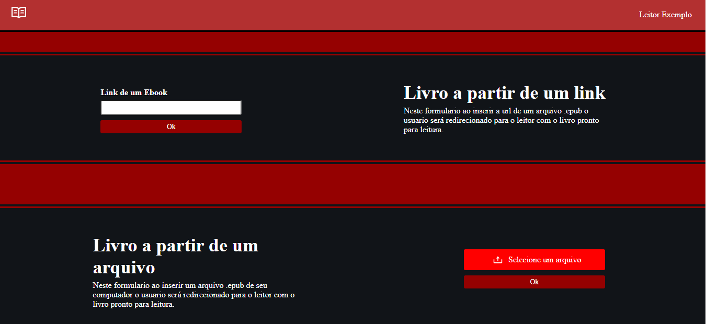
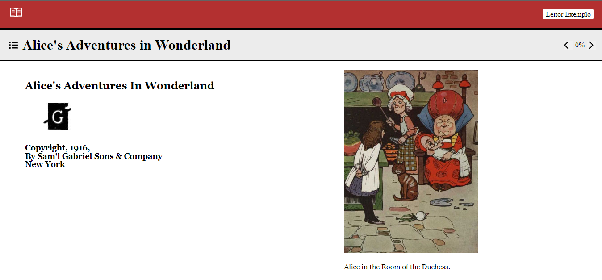
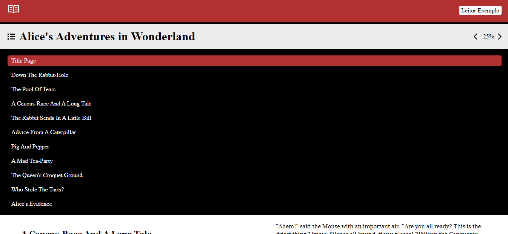

# React Epub Reader

  
  
  

Projeto desenvolvido com o intuito de ser um leitor de arquivos .epub(Ebooks) tanto de links externos quanto da maquina do proprio usuario

## Sumario

 - [Config](#config)
 - [Links Uteis](#links-uteis)
 - [Demonstração](#demonstração)
 - [Comandos utilizados](#comandos-utilizados)

## Config

Run `npm install` to download project dependencies

Run `npm start` to start development server

## Links uteis

- [React Router Dom](https://reactrouter.com/)

- [React icons](https://react-icons.github.io/react-icons/)

- [epubjs git doc](https://github.com/futurepress/epub.js)

- [epubjs md doc](https://github.com/futurepress/epub.js/blob/master/documentation/md/API.md)

- [epubjs doc](http://epubjs.org/documentation/0.3/#locationsload)

## Demonstração

#### Production link: https://react-epub-reader.vercel.app/

  
  
  

## Comandos utilizados

`npm create-react-app`

`npm install react-router-dom@6`

`npm install epubjs`

`npm install react-icons`

 

---

Desenvolvido Por [Alessandro Massarotti Jr](https://github.com/alessandro-massarotti-jr) 🤖